# 3. Foilation

## 3.1. Idea and Background

非公式には、一次元の葉を持つ葉理とは、領域Mを不連続な曲線に分解したものである（図3左）[Moerdijk and Mrcun 2003 ˇ ]。つまり、同じトポロジーを持つ葉の間には1対1の連続的な対応がある。これにより、赤で描かれたMの断面上の低次元の射影写像と、（例えば区間[0, 1]への）個々の葉の一次元の射影写像から、Mと正方形の間の射影写像を作ることができる。区間の低次元写像は、葉の間の一対一の対応を確立する。すべての葉は不連続であり、対になった葉は互いに両対称に写像されるので、全体的な写像は両対称である。例えば、Mと（パンクチャーのある）単位円盤との間の射影写像は、円盤の正準極射影と位相的に等価な射影を用いて構成することができる（図4参照）。これは、点電荷場線写像[Gergen 1930; Xia et al. 2010a; Huynh and Gingold 2015]を一般化した形と見ることができる。

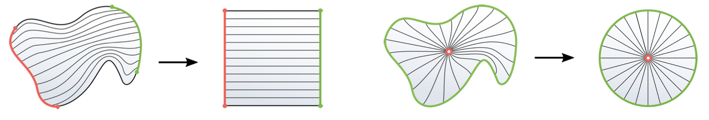

3次元では、葉の断面は2次元であるため、葉の対応関係を確立するためには2次元の断面写像が必要となる（この問題は再帰的に1次元のパラメトリゼーションに還元できる）。この断面写像を用いれば、2次元の場合と同様に、立方体や球への両対称写像を作ることができる。次に、我々のアルゴリズムの説明のために、より正確な定義を紹介する。

### 定義1

フォリエーションとは、多様体Mを一定の次元（ここでは1次元のみを考える）の不連続な低次元の部分多様体（リーフ）に分解したものである。

すなわち、葉は1次元で、それぞれが線分に同相である。つまり、閉じた葉や無限の葉は存在しない。葉が1次元で、それぞれが線分に同相であること、つまり、閉じた葉や無限の葉がないことである。 より一般的な葉形は、他の種類の領域にも有効である（そして、我々の手法の一部は、3次元以上の領域や、球以外の領域にも適用できる）。特異葉は、より低次元の特異葉を含むことができる。我々は、特異葉の1つのタイプのみを考える。それは、全ての葉の閉包にある1つの点特異点（中心）を持つ放射状の葉である。説明を簡単にするために、特異点のある小さな近傍領域（1つの正四面体か三角形）を取り除くことによって得られる領域の非特異点葉状化について考える。この縮小された領域を使って作られた写像は、除去された単峰に簡単に拡張される。1次元の葉を持つフォリエーションの横断面Sは、すべての葉とちょうど1回交差するn - 1次元の部分多様体である。例えば、図3と図4では、赤と緑の曲線が描かれた葉の断面である。各葉がt∈[0, 1]でパラメトリック化されると仮定すると、t = 0またはt = 1ですべての葉と交差する横断面は、それぞれソース部（赤い曲線）、シンク部（緑の曲線）と呼ばれる。

### 3.1.1. Maps from Foliations

フォリエーションの写像
n 多様体 M の自明な葉状構造が与えられると、任意の点 p ∈ M はペア (sp , tp) によって一意に識別できます。ここで、sp は p を通る葉と交差する断面 S 上の点であり、tp はこの葉に沿った p のパラメータ。Sと[0,1]n-1またはS n-1との間の両対称連続写像ψがわかっているとする。これらはそれぞれ、Dの正準直交または極交葉（図3と図4右の赤または緑）の断面である。Ψ(p)=(ψ(sp), tp)はMからD=[0, 1]nまたはD=S n-1 × [0,1]への射影写像である。この写像は、Mにそれぞれ直交座標または極座標を与え、単位正方形／立方体または円盤／球上のパラメトリゼーションを提供する。適切なt（例えば正規化された弧長）の選択により、Ψは連続となる。

### 3.1.2. PL Foliations and Direction Fields

PLフォリオと方向場。Mが三角形または四面体からなるn=2,3の次元の三角形分割された領域である場合、各単射内部の葉が平行な直線の線分である区分線形のフォリアシオンを考えるのが自然である。このような区分線形フォリアは、他のタイプよりも数値的にロバストな方法で扱うことができ、区分定数（PC）ベクトル場によって記述することができる： n-simplexの内部に割り当てられた定数ベクトルdiは、このsimplex内の平行な直線リーフセグメントの方向を指定する。

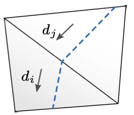

任意のPLフォリエーションはPC方向場を含意するが、逆は真ではない。Mのすべての点を通る一意な積分曲線が存在する場合にのみ、これらの区分線形曲線は葉を形成する（定義上、葉は不連続である）。一意な積分曲線のこの性質は、例えば一様リプシッツ連続ベクトル場のクラスではよく知られているが、問題のPC場のような不連続な場では一般に成立しない。積分曲線は（右図上に描かれているように）マージしたり分裂したりすることがあるが、フォリエーションの葉（下）とは異なる。この違いは非常に重要であり、PC場を直接パラメトリゼーションに使う際の主な障害の一つである。以下では、これらの場の組み合わせ論的条件を導出し、葉理への対応を保証する。各点を通る一意的な積分曲線を持つ一片定数場をフォリア対応と呼ぶ。

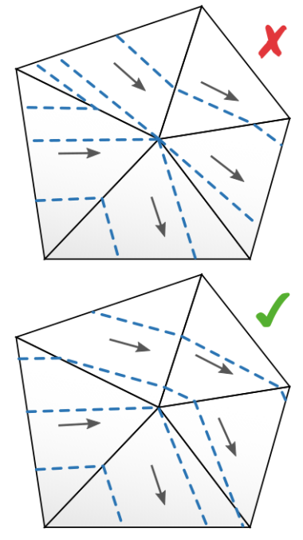

## 3.2.  Generation Algorithm

我々は、領域境界での振る舞いや特異点の非存在に関する制約条件に従って、このようなフォリエーションに適合した方向場を構成する基本的なアルゴリズムを紹介する。セクション4.4では、その詳細な解析と議論を行う。ここでは、0≦k≦nのk-simplicesからなる、n＝2（三角形メッシュ）またはn＝3（四面体メッシュ）の単純メッシュMを考える。n-simplexcと入射(n-1)-simplex fに対して，cの外側を指すfの法線をncfとする．n-simplexが複数の境界(n-1)-simplexを持つことはないと仮定する．n-simplexは、それをMから取り除いて補体MĎに加えると、MとMĎの両方が多様体になる場合に自由である。特異な頂点または辺（その近傍がボールまたは半ボール位相幾何を持たない）がMまたはMĎに作られる場合はこの限りではない。このような自由な単項式が常に利用可能かどうかを問うことができる。セクション4.4で述べるように、そのための必要条件はメッシュが(bi)shellableであることであり、十分条件はメッシュが拡張可能に(bi)shellableであることである。2Dではこれはハードルではなく、3Dでは既知の反例がある。実用的な問題、特にcの選択とdcの選択に関する問題は後で具体化する。分析目的では、この抽象的なアルゴリズムで十分である。次に、なぜ結果の場が葉化適合であることが保証され、つまらない葉化を意味するのかについて述べる。第5節では、葉化適合体から陽的写像Ψ : M → Dとその逆写像を作る方法を説明する。

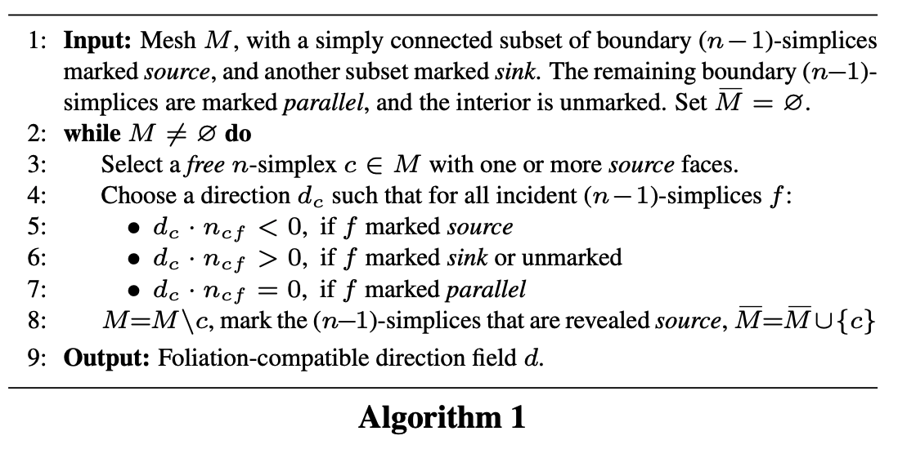
**Input**: メッシュMは、境界の(n-1)個の単純連結された部分集合をソースとし、別の部分集合をシンクとする。残りの境界(n-1)対称は平行とマークされ、内部はマークされていない。MĎ＝φとする。
**While**:{1つ以上のソース面を持つ自由なn-simplex c∈M を選択する。
すべての入射(n-1)対称面fに対して、次のような方向dcを選ぶ：}
n_cf: n-simplexのcと入射(n-1)-simplexのfに対して、cの外側を指すfの法線

# 4. Foliation Compatibility Criteria

葉の適合性基準

PC方向場がフォリエーションを表現するためには、場の局所的な条件が満たされる必要がある。PC方向場が三項対立を表すためには、さらに大域的な条件が必要である。重要なことは、局所的条件も大域的条件も、純粋に離散方向場の組合せ論の観点から定式化できるということである。

## 4.1. Local Condition

局所的な状態
説明を簡単にするために、まず一般的な場を扱う。つまり、n-simplexのdirection dは、その内部のどの辺や面にも平行ではない。

## 4.1.1 Incoming and outgoing simplices

基本的な要件は、この点を通る場の積分曲線dが正確に1つ存在することである。点pを（その内部または境界に）含むn-simplex ci上の場の方向diと、pを方向diに通る直線の線分pをciに限定して考える。点 p を l から取り除くと、 l は方向 -di と di に対応する l- と l+ に分割される。定義2. (incomoming／outgoing n-simplex)半分の線分 l- が空でない場合，その単項式 ci をpに対してincoming（pに対してincomingの積分曲線を与える）と呼び， l+ が空でない場合，ci はpに対してoutgoingである．

### 定義2. (Incoming and outgoing n-simplex)

半分の区分 l- が空でないとき，pに対して入射する（pに対して入射する積分曲線を提供する）単項式を di と呼び， l+ が空でないとき，pに対して出射する単項式を di と呼ぶ．
右の例では，l-が赤，l+が緑： ci は p1 と p2 に対して入射，p2 と p3 に対して出射，p4 に対してどちらでもない．

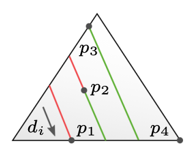

---

場の区分的定数の性質により、もしn-simplex cがk-simplex fの相対的内部にある点pに対して入射（出射）する場合、k＜nであれば、それはfの内部のすべての点に対して入射（出射）することになる。

もしpがn-simplex cの内部に含まれるなら、この条件は自動的に満たされる： cはpに対して入射と出射を持つ。 k < nのk-simplexの相対的内部にある点pについては、その入射n-simplexを考える必要がある：

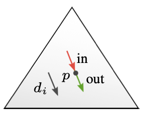

n-simplex上の点pがn-simplex ciとcjに入射する場合、入射するn-simplexはfに対して入射するか出射するかのどちらかしかないので、ciがp（等価的にf）に対して入射し、cjが出射すること、あるいはその逆であることを要求しなければならない。これらの観察から直ちに次の命題が導かれる：

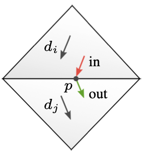

### 命題1

一般的なPC方向場は、k＜nの各内部k-simplexが一意な入射n-simplexと一意な出射n-simplexを持つ場合にのみ、foliation-compatibleである。
を持ち、各境界k-simplexは最大で1つの入射と1つの出射n-simplexを持つ場合にのみ、PC方向場はfoliation-compatibleである。
各境界k-simplexは最大で1つの入射n-simplexと1つの出射n-simplexを持つ。

### 定理1

一般的な境界整列PC方向場は、k＜nの各k-simplexが一意な入射n-simplexと一意な出射n-simplexを持つ場合に限り、foliation-compatibleである。

### 双対グラフ

すなわち、M＊のn個のセルに対応する頂点と、（n-1）-simplexを共有するn個のセルを結ぶ辺を持つグラフである。各内部(n-1)シンプレックスfに対して、入射する2つのn-シンプレックスci とcj の一方が入射し、他方が出射するという条件は、ci とcj を結ぶ双対辺に向きを割り当てることによってモデル化できる2つの選択を可能にすることに注意してください。ci → cjは、ciがfに対して入射で、cjが出射であることを表す。各辺への向きの割り当てをOとすると、対応する有向双対辺グラフをG(M＊ , O)（略称：G）とする。

---

これは，(n-1)-simplex fでは，些細なことだが成り立つ：星は2つのn-simplexから成り，制限Gfは1つの有向辺（あるいは，境界では1つの頂点，これはソースとシンク）を持つ．より低次元の単純体（2次元では頂点、3次元では頂点と辺）では、Gの制限は（頂点に対して右図のように）両極である場合もあるし、そうでない場合もある。ここで、アルゴリズム1の出力が折れ線に適合することを証明するために用いる局所的な基準を定式化することができる。この条件は必要十分条件であり、すなわち、PC場の葉理適合性は完全に組合せ論的な事実である。ciが共通の(n-1)シンプレックスに対して入射し、cjが共通の(n-1)シンプレックスに対して出射する場合、ci → cjである。ciとcjがともに入射または出射の場合，対応する辺は無向のままである．部分配向グラフは決して局所的に双極にはならない。

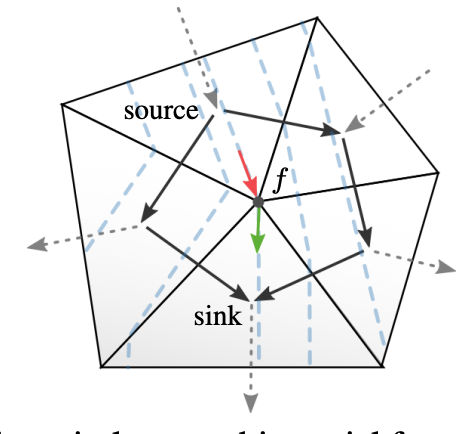

# 5. Evaluating Bijective Maps

一旦foliation-compatible field dが構築されれば、与えられた点p∈Mに対して、写像Ψを評価するためにそのfoliation座標を得ることができる。pが位置する葉lpがSと交わる点をspとし、lpに沿ったpのパラメータをtp∈[0, 1]とする。そして、tpをマイナー座標と呼び、断面点spの像ψ(sp)をメジャー座標と呼ぶ。直交座標または極座標として解釈すると、これらは写像Ψ(p)=(ψ(sp), tp)を定義する。これらの座標は、メッシュを通してPC方向場をトレースする比較的簡単なプロセスによって同時に決定されます。シンプレックスごとに一定の性質があるため、これはシンプレックスを通るd-平行投影のシーケンスに相当します。

## 5.1 Barycentric Field Representation

重心的（バリセントリック）なフィールド表現

各ステップにおいて、アルゴリズム1は、ある入射面を通してciに入り、他の入射面を通してciから出る、n-simplex ci上の方向diを選択しなければならない。

$$
2D:d_i=(u,v,w),u+v+w=0\\
3D:d_i=(u,v,w,x),u+v+w+x=0\\
$$
これらの成分は、入射面（内向き）法線の係数として解釈できるので、それらの符号は、diと（n-1）シンプリックスの外向き法線ncfとのドット積の符号を直接決定する。したがって、与えられた入射／出射の構成に対して、di = (u, v, w) または (u, v, w, x) の成分の絶対値がゼロでないものを任意に選ぶことができる。なぜなら、固定された符号は、方向空間を入射／出射の制約を満たす方向だけにすでに制限しているからである。構造上、入射面と出射面は常に少なくとも1つずつ存在する。これは、両方の符号の成分が常に存在し、制約を満たす(u, v, w)と(u, v, w, x)の選択肢が常に存在することを意味する。このバリセントリック表現は便利であるだけでなく、以下に詳述するように、数値的にロバストな方法で後続のステップを簡単に実行できるようになります。

## 5.2 Leaf Tracing

ここでは3次元の場合を考える。2次元の場合（図6）は漸化式に従う。di=(u,v,w,x)である四面体ciのバリセントリック座標(α,β,γ,δ)で表される点pがあるとする。ciのpを通る（積分曲線の）支持線は、λ∈Rで、線方程式lp,ci (λ) = p - λdi = (α - λu, β - λv, γ - λw, δ -λx)で与えられる。ciの三角面の支持平面とlの交点は、これらの平面上で1つの重心座標成分が消失するという観察に基づいて簡単に決定される。

$$
p=(\alpha,\beta, \gamma,\delta)\\
d_i=(u,v,w,x)\\
l(\lambda)=p-\lambda d_i\\
l(\frac{\alpha}{u})=(0,\beta,\gamma,\delta)-\frac{\alpha}{u}(0,v,w,x)
$$

例えば、4つの交点のうちの1つは 4つの交点のうちのいくつかは（lが頂点または辺と交差する場合）等しいか、または（lが支持平面と交差するが面とは交差しない場合）正四面体の外側にある可能性があることに注意。この初歩的な操作によって，ある単峰から別の単峰へと区分線形積分曲線をなぞることができる．バリセントリック座標は局所的なので，次のn-simplexに渡るときには座標の変更が必要である．共通のk-simplex f上の点については、両方の入射n-simplexを基準とした重心座標は、fの頂点にのみ関係するので、この変換は、一方のn-simplexから他方のn-simplexへの局所頂点インデックスの変化に従って、単に重心座標を並べ替えることになる。

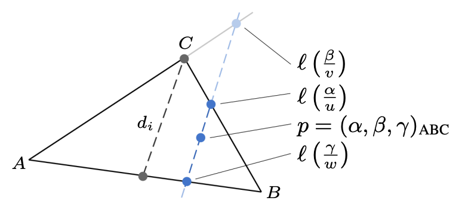

図6：バリセントリック座標系での平行投影による三角形を通る方向場のトレース。

(α, β, γ, δ): 四面体メッシュ内の特定の点を表すためのバリセントリック座標です。四面体メッシュ内の点を表すために使用され、各座標は対応する頂点に対する重みを表します。例えば、(α, β, γ, δ) は四面体の頂点の重み付き和で表される点を示します。

(u, v, w, x): 四面体メッシュ内の特定の方向を表すためのベクトルです。通常、このベクトルは特定の性質や方向を持つために使用されます。Leaf Tracingの文脈では、このベクトルが特定の方向を示すために使用され、点を通過する積分曲線の方向を定義するのに役立ちます。

l: 点 p を含む四面体内の積分曲線（integral curve）を表すための直線です。この直線は点 p を通過し、方向ベクトル d_i = (u, v, w, x) に沿って伸びます。積分曲線は、点 p から出発して特定の方向に延びる直線を表します。

α: バリセントリック座標系における点 p の重み付き和を表す変数です。点 p が四面体内のどの頂点にどの程度関連付けられているかを示します。バリセントリック座標系は、点を四面体の頂点に対する重み付き和として表現する方法です。

u: 方向ベクトル d_i = (u, v, w, x) の成分の1つであり、積分曲線の方向を定義するために使用されるベクトルの成分です。u 成分は積分曲線がどの方向に伸びるかを示します。

λ: 直線 l 上のパラメーターであり、積分曲線の位置を表すために使用されます。λ は直線 l 上を移動するためのパラメーターであり、特定の位置を示すために使用されます。

## 5.3 Major Coordinates

葉が断面 S にぶつかる点 s から、ψを通して主要座標が決定される。異なる場合について、ψは以下のように求められる：

### 5.3.1. Unit Square/Disk

Mを正方形に写像する場合、ψ : S → [0, 1]。これは単純な区分線形曲線のパラメトリゼーション問題であり、例えば、単位区間に正規化された弧の長さに従って実行することができる。Mが円盤に写像される場合、ψ : S → S 1、単位円、そして単純な区分線形曲線の正規化された弧長パラメトリゼーションが使用できる。

### 5.3.2. Unit Cube

立方体への写像の場合、 ψ : S → [0, 1]^2 と、我々の方法の2次元版、または単純にTutteの埋め込みによって、簡単に双射影が得られる。

### 5.3.3. Unit Ball

Mを球に写すとき、ψ : S → S 2、単位球。Sを内側断面に選べば、ψを得るのは簡単である。Sは1つの正四面体の境界であり、各三角形の面を半球の半分に写すことができる。別の方法として、外側の境界をSとすることもできるが、その場合、数値的にロバストな両対称ψの構築がより複雑になる[Gotsman et al.2003; Saba et al.2005]。

## 5.6. Numeric

セクション 3 では純粋に組み合わせアルゴリズムを扱いましたが、葉の追跡と主座標と副座標の決定には幾何学的な計算が含まれるため、数値の堅牢性の問題が生じます。 実数を使用した一般的な計算は、実際には正確に実行することはできず、さらには一貫して実行することさえできません [Yap 1997]。 しかし、有理数の分野では正確な計算が可能です。 いくつかのプログラミング言語にはこれをサポートする機能が組み込まれており、他のライブラリでは、従来の浮動小数点数を扱うのと同じくらい簡単に有理数を扱うことができます。 主に重心表現を使用しているため、このセクションに登場するリーフ トレースおよび座標計算の関数はすべて有理数であることに注意してください。 したがって、引数 p、d、h が有理であれば、結果も有理です。 したがって、p と d の成分が有理重心座標で与えられ、h が有理数値に設定されている場合、すべての計算は比数タイプを使用して正確に実行できます。 葉の真の弧長パラメータ化には h = |d| が必要ですが、これは一般に非合理的であることに注意してください。 ただし、h を |d| の有理近似に設定することはできます。 実際、h > 0 を選択すると、非弧長ではあるものの全単射の葉のパラメータ化が行われます。 h は n-simplex ごとに一定であり、トレース時に計算される h の割合 (セクション 5.4 を参照) は葉の間で連続的に変化するため、マップの連続性も影響を受けません。 有理極座標。 ただし、無理関数が関係する状況が 1 つあります。ディスク マップとボール マップの場合、極パラメータ化をデカルトパラメータ化に変換したい場合があります。 三角関数が関係しているため、これは有理数と無理数を関連付けます。 ただし、有理置換 sin∗ 、 cos∗ を使用して、極座標とデカルト座標の間の代替関係を効果的に定義できます。 唯一の要件は、(sin∗ θ, cos∗ θ) が (sin θ, cos θ) と同様に、ある区間 [a, b) とカット単位円の間の同相写像であることです。 これを達成するために、次のように sin∗ と cos∗ を有理関数 [−1, 3) → [−1, 1] として定義します。

$t_{\sin}(t)=\frac{2t}{1+t^2}, t_{\cos}(t)=\frac{1-t^2}{1+t^2}$

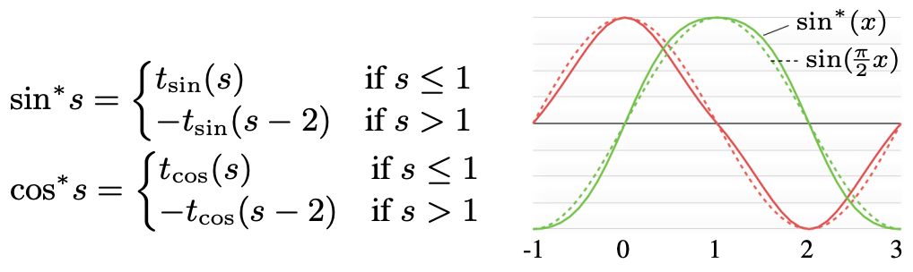

## 6.X. Source and Sink.

### Polar Case

シンク（またはソース）は境界全体である。境界までの距離が最大となるn-simplexを仮想的に取り除くことで、中心がしっかりした内側のソース（またはシンク）を選択します。

### Square Case

（図3参照）、境界を同じ長さの4つの部分に分割する。立方体マップの場合は、∂M上の2つの単純接続された領域をソースとシンクとして選択する必要がある。0,1]正規化フィードラーベクトル（最小二乗ラプラシアンの意味で、最も大域的に平滑な非定数スカラー場）のiso-contoursを使う。iso1 4とiso3 4の等高線は、ソースとシンク領域の境界として自然な選択である。フィードラーベクトルは、∂M上のラプラス・ベルトラミ作用素の2番目に小さい固有値に対応する固有ベクトル（これは非常に効率的に計算できる[Wu et al. 2014]）であり、正のエッジ重みを持つ離散ラプラシアンが使用される場合[Fiedler 1975]、そうして得られたソース領域とシンク領域は一般的に単純接続される。

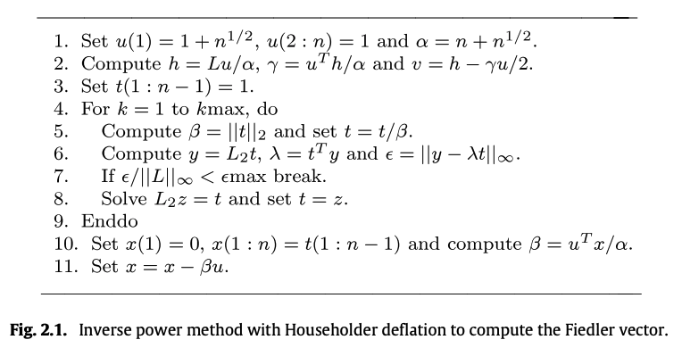

## 6.X. Shelling Order

アルゴリズム1の3行目では、前進する正面の自由なn-単純数を選ぶ。ほとんどの単純要素は自由であることが多いので、多くの選択が可能である。前線を滑らかに保つ試みとして、調和場によって前線を導くことにする。この場は、ディリクレ・エネルギーがソース部で消滅し、シンク部で値1になるという境界条件に従って、ディリクレ・エネルギーの最小化として計算される。そして、各反復において、前進する前線アルゴリズムは、場の値が最も小さい自由なシンプレックスを常に選択する。

## 6.X. Direction Field

一般的に、接線方向の曲率が小さい方向場dは、歪みの少ないマップにつながると予想される。シェリングオーダーが意味する制約の中で、我々は最も滑らかな方向フィールドを求める。この目的のために、最初に方向をその境界の重心に設定する（セクション5.1参照）。次に、ラプラシアン平滑化の数回の制約付きガウス・ザイデル反復を適用し、クランピングによって面の法線と場のドット積の正しい符号を維持する。さらに改善するために、このプロセスは、局所的なシェリング順序の変更と交互に行われる。ある反復において、(n-1)-simplex fijの両側への2つの方向di, djがfijに対してクランプされなければならなかった場合、シェリング順序は、Gの対応する双対辺の向きを反転することによって調整される（局所的かつ大域的な双極性が保たれている場合）。これにより、次の反復で場がさらに滑らかになる。図7は場の平滑化の効果を示している。

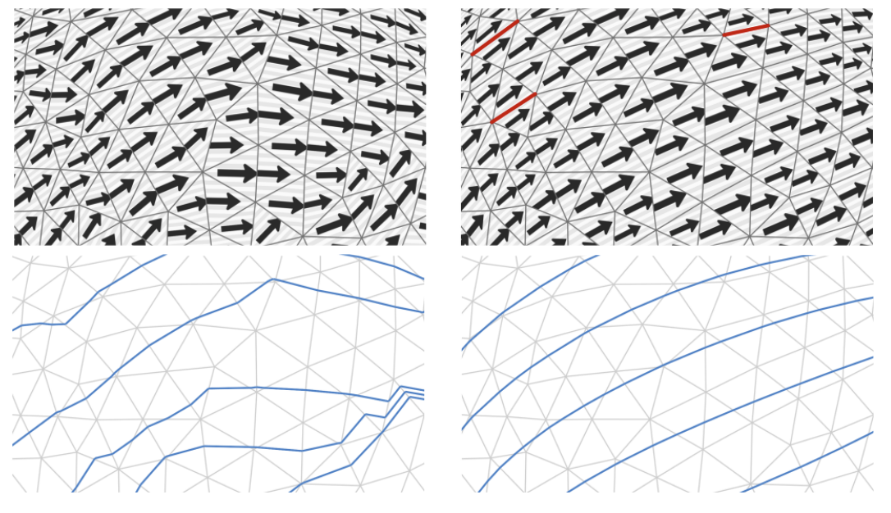
図7：初期場（左）を制約付きで平滑化すると、葉（青）がまっすぐな葉型（右）になる。赤いエッジは、平滑化中に双対エッジの向きが反転したものである。

# 7 Piecewise Linear Representation

セクション 5 では、全単射写像 Ψ を定義し、それが任意の点に対してどのように評価されるかを見ていきました。 さまざまな目的で、このようなマップの区分線形 (PL) 近似 ΨN は、単純なメッシュ N (おそらく M とは異なる) の頂点のマップ値によって完全に定義され、興味深いものになります。 この表現は依然として全単射的かつ連続的でなければなりません。つまり、PL ホーム不同型が求められます。 このような表現により、たとえば、入力が単射マップである場合に単射性を維持できる、さまざまなメッシュベースのマップ品質最適化手法の適用が可能になります [Schuller et al. 2013 ã ; ホーマンとグライナー、2000。 デゲナーら。 2003年; フーら。 2015年; ジンら。 2015年; リップマン 2012; ボムら。 2013]。 点ごとに定義された同型写像をサンプリングすることによってこの特性の近似を取得することは、多次元の場合には一般的な解決策がない難しい問題です [Groff 2003]。 ただし、前のセクションで定義したマップ Ψ は非常に特殊な構造を持っており、これを利用して、頂点のマップ値が PL 準同型性を定義するような単純なメッシュ N を考案できます (α+β +γ = 1)。 は、頂点 v0、v1、v2 を持つ三角形の p の重心座標です (3D の場合は同様に 4 つのコンポーネント)。 一般に M 自体はこの目的に適したメッシュではないことに注意してください。 洗練は避けられない可能性があります。 これは、私たちの特定の葉面ベースのアプローチの結果ではありません。セクション 2 で説明したように、特定の入力メッシュを PL 表現に直接使用することは不可能な場合があります。

$ΨN (p = αv_0 + βv_1 + γv_2) := αΨ(v_0) + βΨ(v_1) + γΨ(v_2),$

## 7.1 PL Structure Extraction

 PL構造抽出
 
## 7.1.1. Initial Refinement

各三角形ciに、diに平行で、ciに実際にある3つの頂点の1つに入射する辺を追加する。その後、メッシュは不適合になる：頂点は三角形の辺に追加され、これらの頂点は、一般的に、反対側の三角形には組み込まれない。

## 7.1.2. Iterative Refinement

辺の1つに非連結頂点vを持つ三角形ciがある限り、diに平行にciを横切る辺を、vから始めてciの反対側の辺で終わるように加える。図8はこの処理の手順を示している。挿入された辺はMの頂点を通る葉を形成していることに注意。

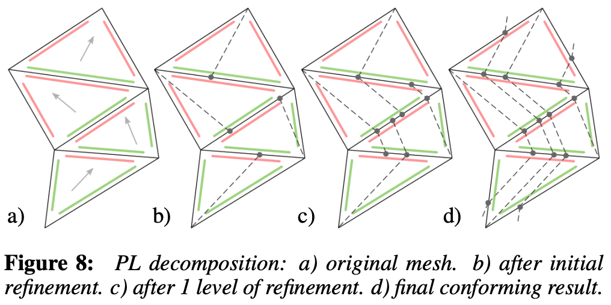

出来上がったメッシュは三角形と四角形の面で構成される。対角線の辺を挿入することで、四辺形の面を三角形に分割する。得られた三角形メッシュはNと呼ばれ、次のような重要な性質を持つ：Nの同じ面内の任意の2点を通る2つの葉は、三角形の同じ列を通る。Nにおけるこれらの面の並びは、離散的な太い葉（図8右の破線の間を走る）として想像することができる。

この疑似コードでは、与えられた三角形メッシュに対してIterative Refinementの手順を実行しています。各三角形内で組み込まれていない頂点を見つけ、その頂点を含むエッジに平行な新しいエッジを追加するという手順が繰り返し行われます。最終的に、すべての頂点が組み込まれるまでこのプロセスが続けられます。

---

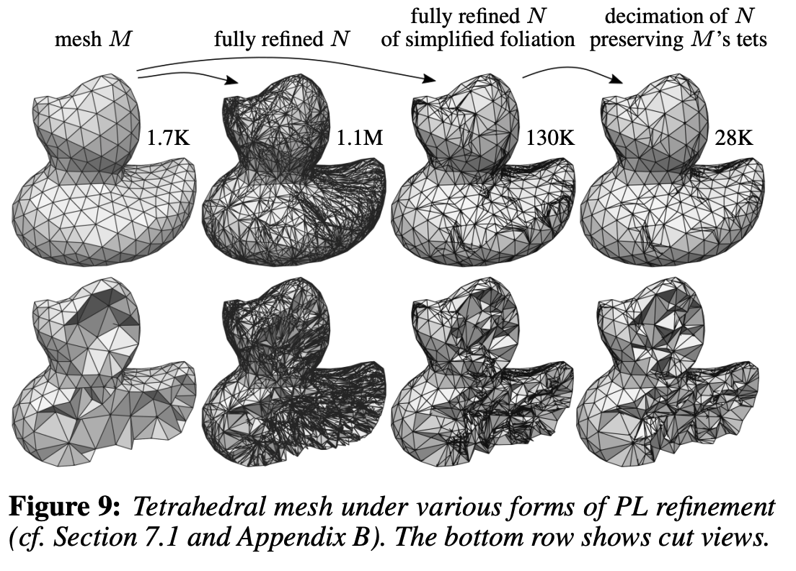

1. Fully refined mesh M:
最初の状態として、元のメッシュ M が完全にリファインされた状態が示されます。

1. Fully refined mesh N:
メッシュ M から始めて、新しいメッシュ N が完全にリファインされた状態が示されます。この段階では、M と N のメッシュ数は異なります。

1. Simplified foliation of N:
N のメッシュが簡略化され、特定の構造（foliation）に変換されます。この段階では、N のメッシュ数が変化し、よりシンプルな構造が形成されます。

1. Decimation of N preserving M's tets:
M のテトラヘドロン（tets）を保持しながら、N を簡略化するための減少処理（decimation）が行われます。この段階で、N のメッシュ数が変化し、M のテトラヘドロン構造が保持されたまま簡略化されたメッシュが生成されます。

これらの段階を通じて、元のメッシュから新しいメッシュへのリファインメントプロセスが示されています。各段階でメッシュの数や構造が変化し、最終的に目的に適した形状や構造が得られるようになります。

---

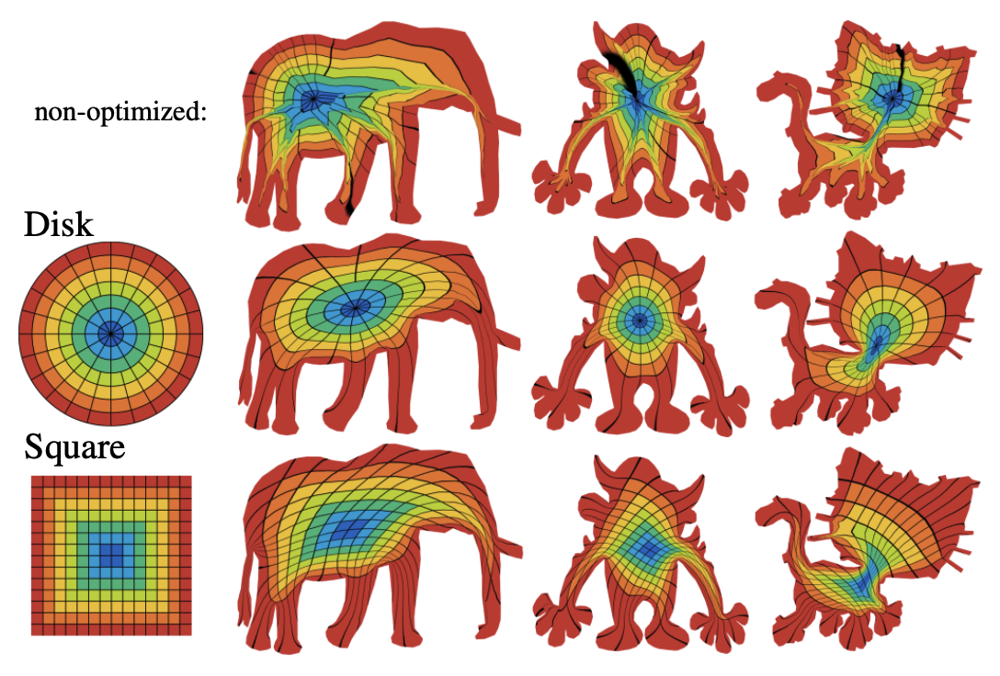

図10：単位円盤または単位正方形への2次元双射の視覚化。これらは、セクションB.2を参照した選択的精密化を用いてPLマップに変換され、厳密有理演算を用いた[Hormann and Greiner 2000]の単純な変形を用いて最適化された。表は、入力三角形の数(|F|)、Nへの完全精密化(full ref.)とM0への選択的精密化(sel. ref.)による三角形の分割数、選択的精密化の実行時間(trefine)、制約付きPLマップ最適化反復の実行時間(topt)を報告している。

---

```py
def PL_Decomposition(mesh):
    new_vertices = []
    new_faces = []
    
    for face in mesh.faces:
        new_face = []
        for vertex in face.vertices:
            new_vertex = calculate_new_vertex_position(vertex)
            # new_vertex を new_vertices リストに追加する。
            # new_vertexのインデックスをnew_faceに追加する。
        # new_face を new_faces リストに追加する。
    
    # new_verticesとnew_facesを使ってnew_meshを作成する。
    return new_mesh

def calculate_new_vertex_position(vertex):
    neighbor_positions = []
    for each neighbor_vertex in vertex.neighbors:
        neighbor_positions.append(neighbor_vertex.position)
    
    # Calculate new position based on average of neighbor positions
    new_position = calculate_average_position(neighbor_positions)
    
    return new_position

def calculate_average_position(positions):
    total_position = [0, 0, 0]
    for position in positions:
        for i in range(3):  # Assuming 3D positions
            total_position[i] += position[i]
    
    average_position = [total_position[0] / len(positions), total_position[1] / len(positions), total_position[2] / len(positions)]
    
    return average_position
```

---

# A.

もちろんです。テトラメッシュに対するFoliationの具体的な操作をステップバイステップで説明します。

1. **初期設定**:
   - テトラメッシュ内の各テトラヘドロンに対して、leafを定義します。leafは1次元の線分として考えられ、各テトラヘドロン内に1本のleafが通るようにします。

2. **Leafの定義**:
   - 各テトラヘドロン内でleafを定義します。leafはテトラヘドロンの辺に沿って伸びる線分として考えられます。

3. **Stacksの形成**:
   - 隣接するテトラヘドロン同士のleafを共有することで、stacks（積み重ね）を形成します。つまり、leafが他のテトラヘドロンと交差しないように、leafを共有するテトラヘドロン同士をグループ化します。

4. **Partitionの形成**:
   - leafを共有するstacksは、テトラヘドロン全体を分割するようになります。各テトラヘドロンは1つのstackに属するようになります。

5. **Leafの追跡**:
   - leafを追跡することで、各テトラヘドロン内の点をleafに沿って特定します。これにより、テトラメッシュ全体をfoliationに沿ってマッピングすることが可能となります。

以上が、テトラメッシュに対するFoliationの基本的な操作のステップです。leafの定義やstacksの形成によって、テトラメッシュ内の各点をfoliationに沿って一意に特定することができます。これにより、テトラメッシュを適切にfoliationすることが可能となります。

---

形成されたPartitionからMappingをするまでの手順をステップバイステップで説明します：

1. **Partitionの形成**:
   - 最初に、与えられたドメインを適切な方法でPartition（分割）します。このPartitionは、ドメインを一次元の葉に分割する構造を与えます。

2. **Transversal SectionのParameterization**:
   - Partitionされたドメインから、元のドメインに対する横断的なセクション（Transversal Section）を選択します。この横断的なセクションは、元のドメインとの接点を持つ部分を指します。

3. **一次元曲線のParameterization**:
   - 選択した横断的なセクションやPartitionされた葉に対して、一次元曲線のParameterizationを行います。これにより、各葉やセクションが適切にParameterizedされます。

4. **低次元Parameterizationの結合**:
   - 低次元のParameterization（葉やセクションのParameterization）をテンソル積のように結合して、全体としてのMappingを構築します。これにより、全体的なParameterizationが形成されます。

5. **Bijective Parameterizationの確立**:
   - 低次元Parameterizationを結合して得られたMappingがBijective（一対一対応）であることを確立します。この手順により、元のドメインと目的のドメインの間にBijectiveなMappingが構築されます。

以上が、PartitionからMappingをするまでの手順の基本的な流れです。この手法は、複雑なドメインや形状を単純なドメインにマッピングする際に使用され、BijectiveなParameterizationを実現するための重要なステップとなります。

---

理解しやすいように、3次元の構造体に引かれた1次元の線（leaf）を使って領域を面で区切るプロセスをステップバイステップで説明します。

1. **Leafの引き方**:
   - 3次元の構造体内に1次元の線（leaf）を複数引きます。各leafは直線状であり、構造体内の点を通過します。

2. **Leafの交差チェック**:
   - 引かれた各leaf同士が交差していないことを確認します。各leafは他のleafと交差しないように配置されている必要があります。

3. **Partitionの形成**:
   - leafを使って構造体を面で区切るために、leaf同士が交差しないようにグループ化します。各leafが他のleafと交差しないように、leaf同士を組み合わせてPartitionを形成します。

4. **面の形成**:
   - 各Partition内のleafを使用して、面を形成します。各Partitionはleafによって定義される領域であり、その領域内の点は同じPartitionに属します。

5. **領域の分割**:
   - 各Partitionによって定義された面によって、構造体全体が面で区切られます。各面はleafによって定義され、構造体内の点はそれぞれの面に属するようになります。

以上が、3次元の構造体に引かれた1次元の線（leaf）を使って領域を面で区切るプロセスの基本的なステップです。leaf同士が交差せず、各leafが特定の領域を定義することによって、構造体全体が適切に面で分割されることが可能となります。

# B. PLマップの近似

完全なリファインメント手順から得られるメッシュNは非常に大きくなる場合があります。節約と効率のために、Ψを近似するより簡単なPLホームオモルフィズムΨM'を作成する方法を考えることが興味深いです。以下に詳細なオプションがあります。

## B.1 ホームオモルフィズムの減少

エッジの折りたたみなどの三角形および四面体メッシュの減少のためのオペレータを使用して、メッシュNをより単純なメッシュM'に減少させることができます。通常のメッシュ減少手法では、エッジを折りたたむ場合は、逆転した要素にならないようにするだけです。私たちはメッシュだけでなく、PLホームオモルフィズムを扱っているため、Nの要素とΨによるイメージの両方が正の向きを保つことを確認する必要があります。言い換えれば、NとΨ(N)の2つの同型メッシュを、逆転を避けながら同期して減少させることになります。図9は、メッシュNの減少がMのリファインメントを維持するように制限された例を示しています。

## B.2 選択的リファインメント

減少手法の欠点は、中間メッシュNの高い複雑さです。より実用的な代替手法として、逆の方向から問題に取り組むことができます。完全にリファインされたメッシュNを減少させるのではなく、元のメッシュMを必要な範囲までのみリファインしましょう。したがって、潜在的に過少サンプリングされた非単射マップΨMを考慮し、Mが過少サンプリングされている部分をリファインして単射になるまで進め、ホームオモルフィズムΨM'を作成します。ここで、キーとなる難点は、リファインメントプロセスの収束を保証することです。ただし、Nがホームオモルフィズムに適したメッシュであるという知識を利用することで、Nに進展する選択的リファインメントアルゴリズムを設計することができます。これにより、終了が保証されます。以下では、2Dの場合にこれを実証します。
Mの三角形をマスタートライアングルとし、リファインメントによって生成されるサブトライアングルをその一部と呼びます。イメージが逆転または退化している三角形を違反三角形と呼びます。増分リファインメント手順は非常にシンプルです。違反している（マスターまたはサブ）三角形が存在する限り、その三角形に入射または出射する頂点を逆のエッジに投影し、そこに新しい頂点を挿入し、この新しい頂点を組み込むために隣接する2つのマスタートライアングルをサブトライアングルに再三角化します。図13にイラストが示されています。
このアルゴリズムの正当性を確認するために、まず、エッジに平行なdiを持つ三角形ci（またはそのサブトライアングルのいずれか）は決して違反しません。これは、この場合、2つのインシデント頂点が同じ主要座標を持つことから明らかです（付録A.6を参照）。平行投影された頂点の挿入により、ciの2つの結果のサブトライアングルはdiに平行なエッジを持つようになります。これには、三角形のサブトライアングルの中で互いに平行な投影頂点が対応するエッジで接続されていることを確認する必要があります。

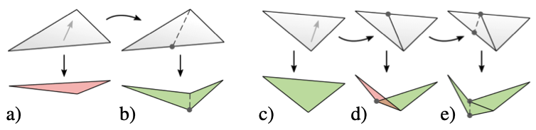
図13：選択的精密化。
(a) ある三角形が違反、すなわちそのイメージが縮退または反転している場合（赤）、頂点が投影され挿入される。
(b) その後、2つの部分三角形は違反しない（緑）。
(c) 非侵害の三角形が精密化された場合。
(d) 隣接する三角形の精密化によって新しい頂点が生じたため、その部分三角形が違反になる可能性がある。
(e) 頂点を投影し、再び挿入すると違反は修正される。

## B.3 フォリエーションの簡素化

デシメーションと選択的リファインメントの両方のアプローチは、ある程度Nによって与えられるPL構造に依存しています。これは、最初にNをより単純にするためにフォリエーションの構築における自由度を利用できるかどうかという問題を提起します。
Nは、各頂点の積分曲線（各エッジの積分曲面）に沿って分割することによってMから得られます。もし、複数の頂点（エッジ）が同じ積分曲線（曲面）上に存在する、つまり同じ積分曲線（曲面）上にある場合、これによってNを単純化することができます。これにより、分割曲線（曲面）の総数を減らすことができます。次のように行うことができます：三角形ciとcjの間のエッジfijに平行なフィールドdi、djを設定すると、fijに接続する2つの頂点は共通の積分曲線上に存在します。同様に、テトラヘドロンciとcjの間の2-シンプレックスfijに平行なフィールドdi、djを設定すると、fijに接続する3つのエッジは共通の積分曲面上に存在します。これらの場合、セクション4から逸脱することに注意してくださいが、両方のn-シンプレックスは共通の(n-1)-シンプレックスfij上の点に対して入射（および出射）です。ただし、両方のシンプレックスは同じ積分曲線を提供するため、これはフォリエーションの互換性を侵害しません。実際には、2つのn-シンプレックスは仮想的にマージされたものとして扱うことができます。なぜなら、共通の方向di = djを持っているからです。

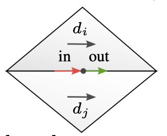

向き付けられた双対エッジグラフGの観点からは、これは双対エッジci→cjを折りたたみ、2つのn-シンプレックスを仮想的にマージすることに対応しています。もちろん、これをどこでも行うことはできません。向き付けられたグラフは局所的にもグローバルにも双極性を保つ必要があります。したがって、貪欲な双対エッジ削除戦略を提案します。向き付けられた双対エッジグラフを入力とし、双対エッジは1つずつ折りたたまれ、仮想的な折りたたみがフィールドに与える偏差によって順番に並べられます（dを平行に調整するため）。ただし、双極性が破られる場合は（局所的に簡単にテストできる）、そのエッジの折りたたみは行われません。挿入された図は、例として結果のフィールドを示しています。

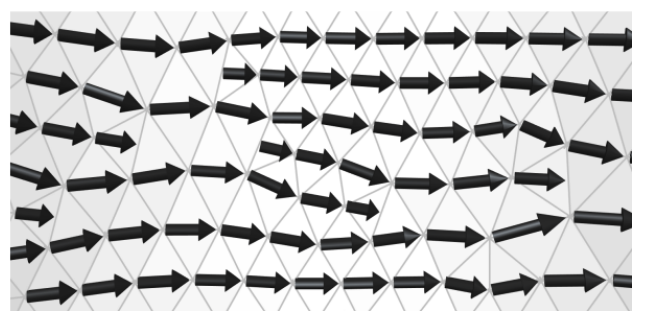

ほとんどの方向ベクトルが現在、メッシュのエッジに整列していることに注意してください。フォリエーションの簡素化がNに与える影響は、図9に示されています。最終マップの連続性を保つために、h≈|d|（セクション5.6を参照）の合理的な近似は、フィールドが平行な(n-1)-シンプレックスに隣接するn-シンプレックスで一貫している必要があります。


---

# 聞きたいこと

- source/sinkはどうやって決めればいい？
- 葉をどう活用すればいい？
  - Sphireに対応させるには？対応するメッシュとは？
  - ３次元上での線分となる葉を使って面で分割するには？
- 円滑なHarmonic Fieldを得るためのエッジの反転って何が基準？
- パラメタsは各区間ごとに[0,1]なのか全体を通して[0,1]なのか？各メッシュでの速度（dx/ds）は変わる？
- 軸受のBijective Mapが終わったら次のステップは？
- 

# Laplacian smoothing


